# Complete guide to open source licenses for developers

- [Introduction](#introduction)
    - [Disclaimer](#disclaimer)
- [Open source licenses](#open-source-licenses)
- [About popular licenses](#about-popular-licenses)
    - [GNU General Public License](#gnu-general-public-license)
    - [Apache](#apache)
    - [MIT](#mit)
    - [BSD](#bsd)
- [Other interesting licenses](#other-interesting-licenses)
- [What about unlicensed projects?](#what-about-unlicensed-projects)
- [Compatibility of licenses](#compatibility-of-licenses)
- [Multi-licensing](#multi-licensing)
    - [How to correctly add multiple licenses to your GitHub project?](#how-to-correctly-add-multiple-licenses-to-your-github-project)
- [About changing the license](#about-changing-the-license)
    - [Contributor License Agreement (CLA)](#contributor-license-agreement-cla)
- [Open source policies in commercial companies](#open-source-policies-in-commercial-companies)
- [Friendly licenses for proprietary software](#friendly-licenses-for-proprietary-software)
- [Interesting legal cases](#interesting-legal-cases)
- [Using license templates (GitHub, GitLab)](#using-license-templates-github-gitlab)

## Introduction

Developers do not often pay attention to licenses when using various open-source projects. We can often use projects*/part of a project or functions for our applications and programs without thinking about how it might affect the future. Do you need to keep copyright? What are the requirements and obligations of different licenses? In this article, I want to highlight the issue of choosing licenses for the project and the specifics of using projects with different types of licenses. 
> *Here and below, the project refers to an open-source project or repository.

At Cisco, I have been developing two platforms for code exchange. [Code Exchange](https://developer.cisco.com/codeexchange/) and [Automation Exchange](https://developer.cisco.com/network-automation/) are aggregators of open-source projects. We have requirements for the availability of licenses, for the availability of copyrights, etc. Below I will share information about licenses and their use for commercial projects/proprietary software.

### Disclaimer:

Information in this guide should not be considered legal advice.

## Open source licenses

A license for open source projects is a legal contract that regulates the relationship between the author(s) and the user, which describes the terms of use of the project/code, including in commercial programs. The license defines what can and cannot be done with the software components, the obligations, and the features of use. Also, the license regulates the responsibility of the authors and contributors to the project. Courts of different countries have ruled that an open-source license is an enforceable contract.

In licenses, pragmatism and free software ideology often fight. When we hear open source, we may think that it is possible to use/modify projects without problems. Still, as mentioned above, each license imposes certain obligations from the moment of use, at least - to keep the copyright. Specific licenses may require you to publish the source code of the entire project in which the code was used, for example, when using a project under the GPL license.

Licenses can be divided into:

* Copyleft (GPL, Mozilla Public License, Eclipse, CC-SA, Microsoft Public License, etc.),
* Permissive (Apache, MIT, BSD, etc.).

Copyleft can also be divided into **“weak”** and **“strong”**:

* **"strong"** include GNU, GNU Affero General Public License
* **"weak"** - for example, Eclipse, GNU Lesser General Public License (LGPL).

For weak copyleft licenses, it is permissible to compile via dynamic linking weak copyleft software with proprietary software without requiring your proprietary software to be licensed under the weak copyleft license.

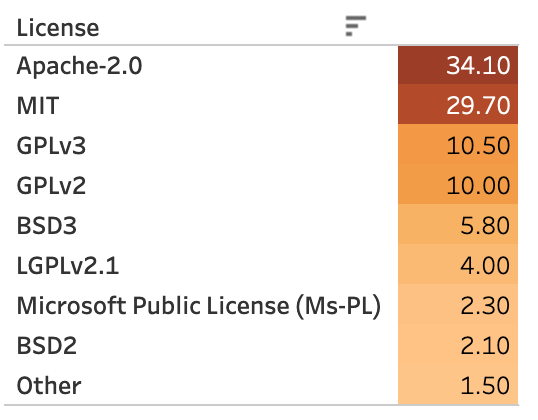

This is what the Top licenses looked like in 2021. Data: MEND open source research

But what is the difference, for example, between different copyleft or permissive licenses?

For this, it is necessary to dive deep into the license text and look for differences there, as well as in legal cases and judicial practice. Also, unfortunately, the speed of reading licenses can be equal to the rate of reading the user agreement.

In this regard, infographics like:

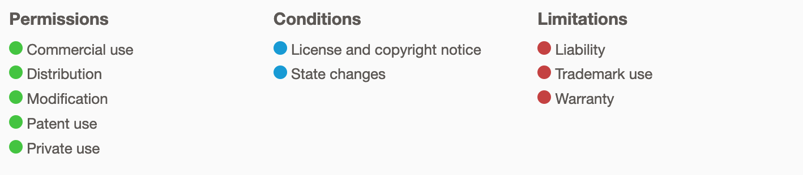

Generally, it is common practice to recommend a license for use (except superseded ones) from the [Open Source Initiative (OSI)](https://opensource.org/licenses/alphabetical) list. There is a separate term - **Source-available** for projects that are distributed with licenses, not from the OSI list.

## About popular licenses

### GNU General Public License

The GPL is generally considered an "aggressive" license, which sometimes is incompatible with other copyleft licenses. 
In addition, this license is often called viral license because they are transferred from project to project.

If you use GPL-licensed projects in your software, then all your software is considered a "work based on" the GPL. Be able to disclosure corresponding source codes by request. Copyright and patent usage rights are unregulated. Who then monitors that GPL projects remain copyleft? Various associations and unions do this, but in addition, individual contributors and free software evangelists ([Harald Welte](https://wiki.fsfe.org/Migrated/GPL%20Enforcement%20Cases)) also act as plaintiffs in cases of violation of the license agreement. Besides Free Software Foundation (FSF) - this organization owns the rights to parts of the GNU systems project.

**Exceptions to the GNU Lesser General Public License**

Until 1999, the license was called the GNU Library General Public License. GNU LGPL was created not to violate the principles of free software so that developers can use this license for their libraries and scripts. In addition, other developers and companies can use the relevant projects with the LGPL license without affecting the license of the main/compiled project, derivative work (including commercial ones).

Projects using the GNU GPL: [Linux Kernel](https://github.com/torvalds/linux), WordPress (GNU GPL-2.0), Solidity, the Smart Contract Programming Language (GNU GPL v3.0), [Grafana](https://github.com/grafana/grafana) (GNU Affero General Public License v3.0), FFmpeg (GNU Lesser General Public License (LGPL) version 2.1), [Signal](https://github.com/signalapp/Signal-Server) (GNU Affero General Public License v3.0)

### Apache

Unlike other permissive licenses, it has clause 3 (3. Grant of Patent License.), which refers to patents. The Clause governs the disposal of patents: participants grant permission to use any of their patents that may relate to their contribution.

Also, if you have modified parts of the files/code, you can apply for a new license. And indicate all the files that have been changed.

The difference between Apache 1.0 and Apache 1.1, Apache 2.0 licenses is that version 1.0 removed the requirement that all promotional materials of the project should contain the message "This product includes software developed by the Apache Group* for use in the Apache HTTP server project (http://www.apache.org/)." In later versions, it is enough to simply place the license in the root of your repository.

Also, you can release/publish a modified version of the project (which was under the Apache license) under a different license, excluding those files that were not modified.

The popularity of this license is constantly growing, not least because this type of license has been chosen as mandatory for [projects by the Cloud Native Computing Foundation.](https://github.com/cncf/foundation/blob/main/charter.md#11-ip-policy)

**Projects using Apache 2.0:** Kubernetes, Selenium, TensorFlow

### MIT

The license allows you to do whatever you want with the code; the only requirement is keeping the original license and attribution information. If choosing between permissive licenses for your project, I would choose and recommend MIT.

In short, it is straightforward, does not require additional NOTICE files, and you can use copyrights of any organization and trademark.

There are projects and resources that **automatically apply the specific license** to code/content that you created using related project
For example: 
- The ISC License is the default license used when setting up a new npm package with the npm init command. 
> [The ISC License](https://choosealicense.com/licenses/isc/) (ISC) is functionally identical to the MIT License, but with some wording deemed unnecessary removed.
- CodePen's are [automatically MIT licensed](https://blog.codepen.io/documentation/licensing/).

**Projects using MIT:** Visual Studio Code, Julia Language, Electron, Angular.js, Rails

### BSD
BSD (Berkeley Source Distribution). Permissive open source license that retains license and copyright notices. The license allows the distribution of more significant or licensed works without source code and under other license terms. The 2-Clause BSD License is very similar to the MIT License.

The modified 3-Clause BSD version protects you/the contributor from having your name used in the project if you don't want it, thanks to the unsupported posting.

Also, there is a license [BSD+Patent](https://opensource.org/licenses/BSDplusPatent) that regulates patent issues. And each copyright holder and contributor with this grants an irrevocable patent license. But, good news for patent owners - "The patent license shall not apply to any other combinations which include the Contribution."

Some code of BSD projects distributed under BSD or similar licenses is used in commercial Windows, macOS, and iOS software.

**Projects running BSD:** Flutter, libssh2

## Other interesting licenses

[Do What The F*ck You Want To Public License](https://spdx.org/licenses/WTFPL.html) - no comments here, in fact the license can be classified as permissive.  Some corporate legal departments find it to be too vague and ambiguous to be a legally effective license and thus prohibit using software with that license.

**Open Government License — Canada**

Canadian government license for open source. According to [the text](https://open.canada.ca/en/open-government-licence-canada), the license can be classified as permissive. However, as noted in the [License text](https://github.com/canada-ca/open-source-logiciel-libre/blob/master/LICENSE.md), the license is also subject to "Crown Copyright".

**Business Source License 1.1**

License from MariaDB Corporation, which develops the relational database project of the same name. The license is attractive in that it limits the project's use only in a non-production project (non-production use of the Licensed Work).

Restrictions are set for four years. And the term is calculated from the change date or the fourth anniversary of the first public distribution of a specific version of the project, whichever comes first.

The BSL license does not meet the definition of open source. It is part of a family of licenses sometimes referred to as "source-available" licenses, which look and act like open source licenses but fail to meet the definition of Open Source by the Open Source Initiative.

## What about unlicensed projects?

If the project is published without a license, it does not mean that it can be used.

By default, the software is protected by exclusive copyright, and without a license, use is illegal, even if the project is published. Only the license grants permission to use, copy, distribute, or modify the software without risk of infringement if the terms are met.

In particular, we cannot accept and publish projects without a license on our project exchange platforms. Most organizations and companies also do not publish their projects without licenses.

## Compatibility of licenses

Each application/program usually involves many different libraries, and projects, each of which has its license with its own set of conditions. So how can you ensure that all the licenses you use are compatible and compliant? 

Black Duck Audit Services [found](https://www.synopsys.com/content/dam/synopsys/sig-assets/reports/rep-ossra-2022.pdf) that 53% of audited codebases in 2021 contained open source code with conflicting licenses. 20% had open source projects without licenses or custom licenses. In general, 97% of commercial code contains various parts and open source projects. Most licenses protect and insure authors from possible lawsuits or damages that may be caused during the use of open source components and projects in commercial products.

Next, I will list some examples of license compatibility/incompatibility.

The Ms-PL license is attractive because it does not oblige you to publish the source code. However, the license also obliges you to retain all copyright, patent, trademark, and attribution notice originally present in the software.

Microsoft Public License (Ms-PL) and Microsoft Reciprocal License (Ms-RL) compatibility. The difference between them is that Ms-RL is a copyleft, so you can modify and use the files as long as you keep the source code under the Ms-RL license. Interestingly, most projects are now distributed under the MIT and Apache-2.0 licenses.

Ms-PL is not compatible with the GNU GPL. (Ms-PL clause enables compiling the program without distributing the source code.)

2-clause BSD and 3-clause BSD are compatible with the GNU GPL.

The Apache 2.0 license is compatible with the GPLv3, provided, of course, that the final software is to be released under the GPLv3.

However, Apache 2.0 is incompatible with GPLv2 because a restriction stops the release of a patented work if a court has found a patent infringing (Clause 7 of the [GNU GPL-2.0](https://opensource.org/licenses/GPL-2.0)).

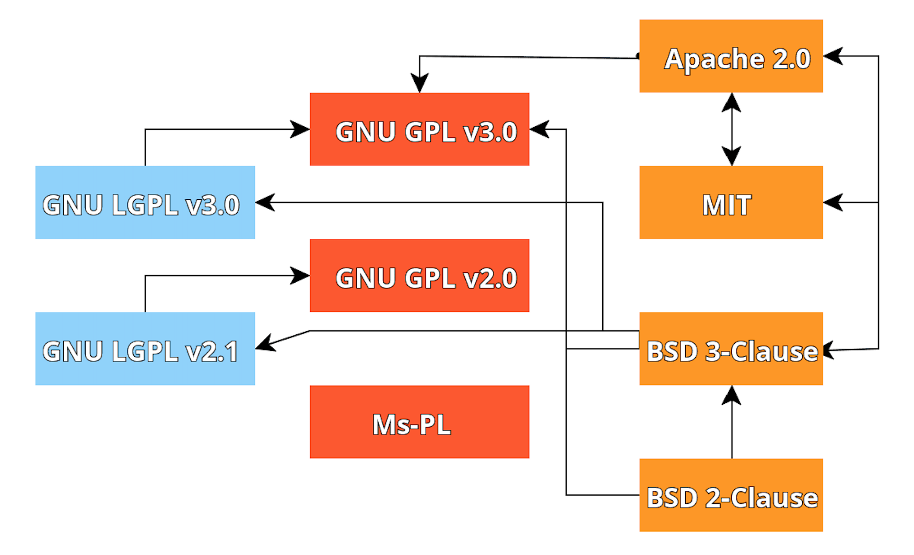

> If the licenses are compatible, there is an arrow between them. The direction of the arrow indicates the more substantial license. A substantial/strong, inclusive license means a license that essentially includes all the key terms of another license. 

## Multi-licensing

Some projects are released and published under two or more licenses. Very often, multi-licensing in a project involves using both copyleft and proprietary licenses. This principle gives users and organizations more freedom in using the project/code.

For supporters of free distribution of code and programs, you can, for example, keep the GPL license, and for others who want to monetize their products and use the project in commercial solutions with patenting and without publishing the code, you can use a proprietary license.

In addition, several licenses allow you to apply for one of the corresponding licenses. And thus avoid conflict of licenses when integrating the project into the main application/project in which solutions with other licenses were already involved.

An example of using multiple licenses is the Perl programming language. It has a [GPL](https://github.com/Perl/perl5/blob/blead/Copying) license, which is placed in the Copying file, and the [Artistic](https://github.com/Perl/perl5/blob/blead/Artistic) license is also placed in the root directory. The Readme states that it is possible to distribute and/or modify the project according to the terms of one of the licenses.

In addition, the License file may not contain the text of the license directly but information about the licenses under which the project is published or which projects/libraries are included in it. For example [OpenPDF](https://github.com/LibrePDF/OpenPDF/blob/master/LICENSE.md).

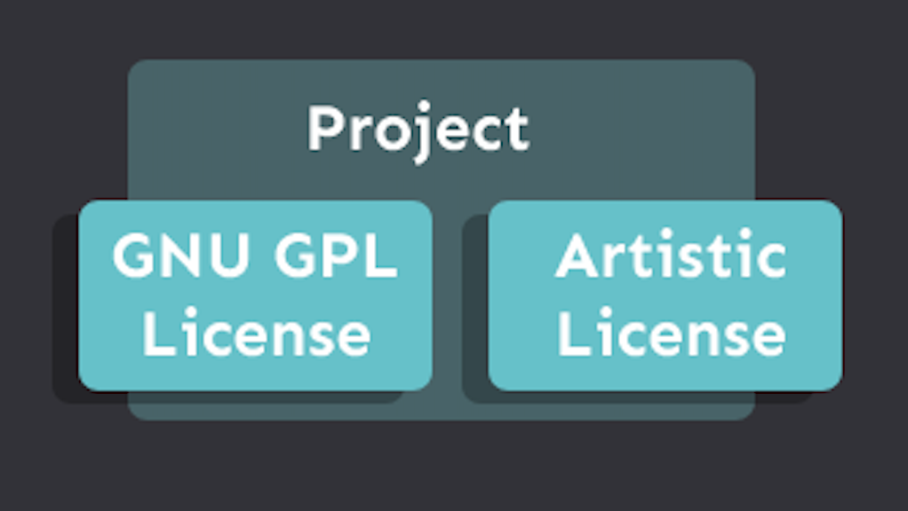

## How to correctly add multiple licenses to your GitHub project? 

To display correctly on GitHub, you must add license files with the appropriate text inside. And place the files in the root directory of your project.

The keyword License or COPYING must be placed at the beginning of the file name, for example, License.BSD, License_MIT. An excellent example of how to organize multiple licenses - [RocksDB](https://github.com/facebook/rocksdb/)

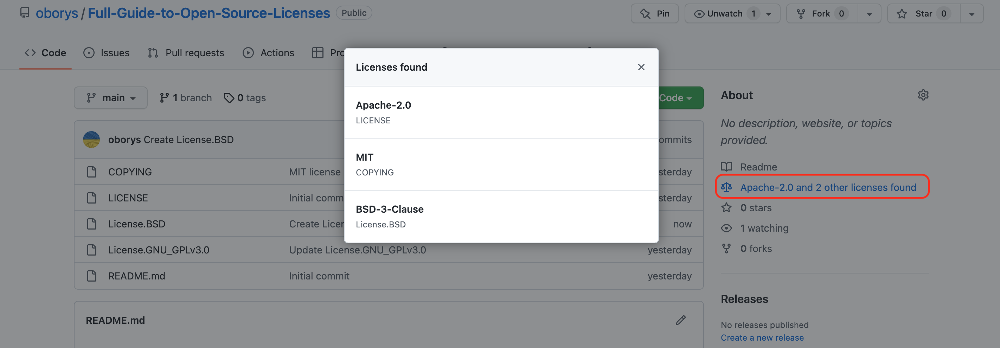
> A dialog window with Licenses on GitHub

## The project includes a fork or part of another project with different licenses.

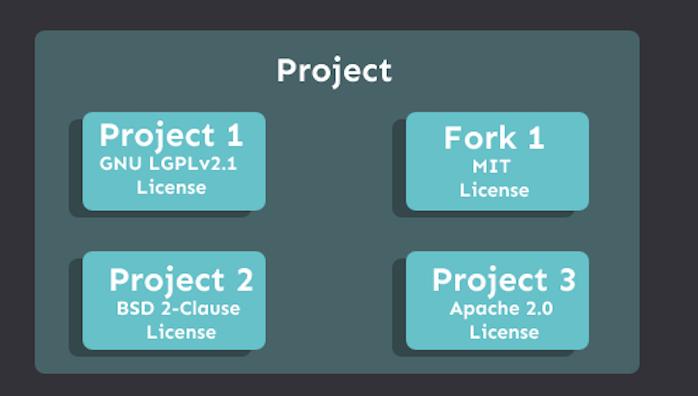

When your open source project contains forks of other projects or uses project code with different licenses and copyrights, create a separate directory where you place the licenses of the projects that are used in your project. Refer to the following examples:

[Kubernetes example](https://github.com/kubernetes/kubernetes/tree/master/LICENSES), 
[Elasticsearch client license](https://github.com/elastic/elasticsearch/tree/main/client/rest/licenses), 
[CockroachDB](https://github.com/cockroachdb/cockroach/blob/master/LICENSE). 

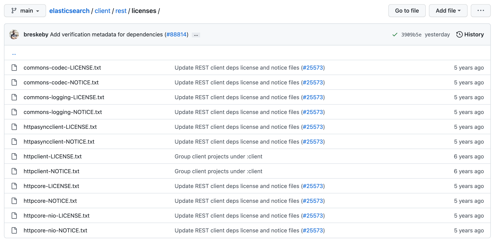

A recommended practice is to add appropriate license and copyright information to each code file, as shown in the following example:

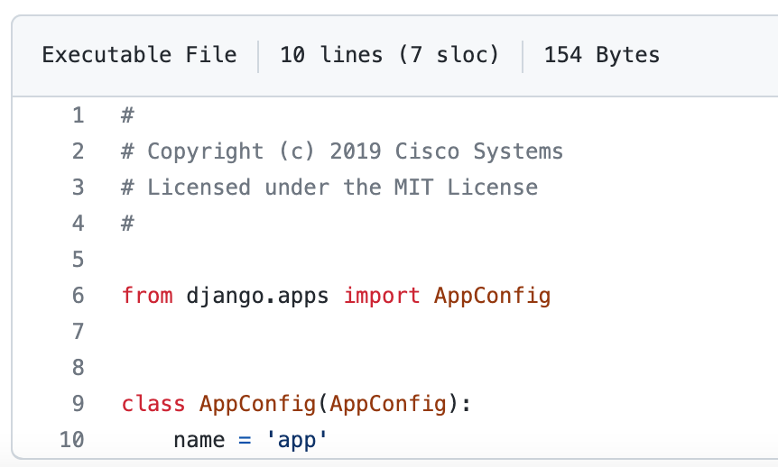

Sample: About [License Headers in Contributing to elasticsearch](https://github.com/elastic/elasticsearch/blob/main/CONTRIBUTING.md#license-headers).

## About changing the license

Can a project be relicensed under a different license? Yes, the license can be changed, but the license change must be agreed upon with all project contributors. Even if it was a contributor to the Readme file. So it's good to do it in the beginning when you're the only contributor. You can even change the license to a proprietary license, but such a change is not retroactive. Accordingly, all previous versions/releases can be used with the licenses in place at that time.
There are cases when you transfer rights (copyright, moral rights) to an organization, a legal entity that owns the rights to the project. In this case, the relevant rights owners can change the license without the contributors' consent. See [Contributor License Agreement (CLA)](#contributor-license-agreement-cla)

**Case:** Facebook was using a BSD license plus their custom Additional Grant of Patent Rights. License [was changed to MIT](https://github.com/facebook/react/commit/b765fb25ebc6e53bb8de2496d2828d9d01c2774b ) on September 26, 2017, and the Patent grant was deleted.
Some companies decide not to use React in their project because of the patent grant. 
> “The license granted hereunder will terminate, automatically and without notice, if you (or any of your subsidiaries, corporate affiliates or agents) initiate directly or indirectly, or take a direct financial interest in, any Patent Assertion” 

A number of licenses require the project to be released under the same license and version or a later version of the corresponding license (e.g., GNU LGPL).

### Contributor License Agreement (CLA)

CLA - the document that regulates intellectual property of user contribution.
In some cases, open source project owners/maintainers ask to sign a Contributor Agreement, which can affect copyright and other rules. So signing the CLA is one requirement for reviewing your Pull/Merge request.

**Two options are available:**
- **Copyright License.** The contributors retain the copyright to their contribution. Sample: [InfluxDB](https://www.influxdata.com/legal/cla/)
- **Copyright Assignment.** The contributors transfer the copyright of their contribution to the project. Sample: [Clojure Contributor License Agreement](https://secure.na1.echosign.com/public/hostedForm?formid=95YMDL576B336E)

Transfer the copyright. Sample from the [MongoDB Contributor Agreement](https://www.mongodb.com/legal/contributor-agreement)
By submitting a Contribution, you assign to MongoDB all right, title and interest in any copyright you have in the Contribution, and you waive any rights, including any moral rights, database rights, etc., that may affect our ownership of the copyright in the Contribution.

Open source [Contributor License Agreement assistant](https://github.com/cla-assistant/cla-assistant)

## Friendly licenses for proprietary software

For commercial companies, the question always arises, which products can be used in commercial/proprietary software (solutions), and what are the exceptions for this? Although, in particular, most licenses can be used in commercial software, you must also consider whether you are not violating other rights, including rights to trademarks and patents.

Permissive licenses are often called commercially friendly. However, if the application/device uses a part licensed under the GPL, then, accordingly, the issue of publishing the entire source code will arise.

Many commercial organizations and non-commercial organizations created their open source licenses with appropriate names:

* Common Public License (IBM).
* Eclipse.
* PHP License 3.01.
* Mozilla Public License 2.0 (uses [Terraform](https://github.com/hashicorp/terraform)).
* W3C License (W3C).
* European Union Public License.
* Python License.

For many projects and products, it is important to keep track of which open source projects and under which licenses you use.

In particular, Open source inventory is a mandatory stage in the following cases:
* Security audit of the company;
* Certifications (including information security);
* Merge and acquisition operations. The scope of the company's intellectual rights, patents, and developments should be determined.
* Investments in startups

In my experience of working with startups, only once have they asked whether open source component licenses allow them to be used in commercial solutions and what obligations arise.

Unfortunately, most project analyzers (Open source inventory) are applied before external requirements and are not integrated into the development process. And then, the report on the compatibility of licenses may look like a disappointing diagnosis of a doctor, and conditional treatment in such a case may be painful — rewriting components and searching for a replacement with appropriate licenses/patents.

Instead, it is better to go through prevention, that is, to conditionally know about the topic of licenses - this guide is written for this. So creating license usage documentation and policies can help, regardless of the size of your company.

## Open source policies in commercial companies

Some companies create their licensing policies. The policies describe procedures and requirements for publishing projects. In addition, there are also requirements for project licenses that can be used in the company. There may also be lists of valid and invalid licenses (for example, open-source licenses block/allow list).

In particular, permissive licenses (Apache, MIT, BSD) or other special licenses of companies are usually added to the permissible ones. In most companies/organizations, the default copyright is the legal name. When creating and contributing to relevant projects, intellectual rights may belong to individual employees or be transferred to the company/customer (where the employee works), unless otherwise specified in the contract.

For example, patent protection covers specific processes, products and methods; and copyright protects the corresponding work, in our case, program code, graphic elements, and images.

For StackOverflow users, it will be interesting to know that according to the [Terms of Service](https://stackoverflow.com/legal/terms-of-service/public#licensing), all content created on the platform (including questions and answers) is licensed under Attribution-ShareAlike 4.0 International (CC BY-SA 4.0) and it's copyleft. Using StackOverflow snippets can be a problem for your company's legal department.

I give an example of a list of licenses with a level of risk relative to use in proprietary software. The greater the risk, the greater the problem of using adequately licensed components in your proprietary (commercial) software.

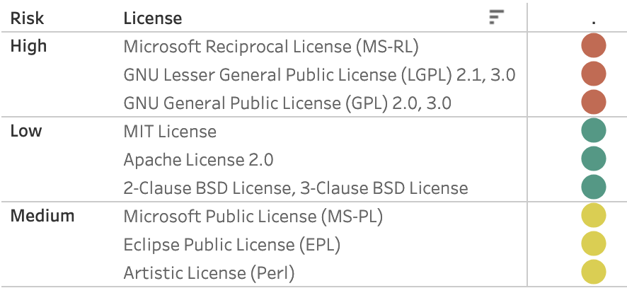

Open source inventory (BoM) is a mandatory stage before mergers and acquisitions, IPOs, and attracting investments. As a result, you can get information about the dependencies and licenses of the included components.

Such reports can also identify components with restrictive requirements or incompatible with other components.

Reports contain information about all included libraries/projects, including transitive dependencies.

In the security field, we can often find tools for collecting information about the components of the analyzed software. Some of these tools and products also report information about licenses and conflicts between them. Most of the functionality of such tools is paid.

## Interesting legal cases

**[GOOGLE LLC v. ORACLE AMERICA, INC.](https://www.supremecourt.gov/opinions/20pdf/18-956_d18f.pdf)**

As often happens, large corporations acquire many projects and startups. Later, problems or claims regarding using open source projects or other resources protected by patents and copyrights appear.

Google bought Android. Android code used Java API methods. Oracle's lawsuit alleged patent and copyright infringement related to Java SE. The trial took several stages, resumption of hearings in various courts. A decision by the US Supreme Court has determined that use falls under the term "fair use".

**GitHub Copilot**

For example, if you are training a neural network or your product includes models that are licensed under a free content license, what obligations arise in this case?

GitHub Copilot was trained on repositories, including those with copyleft licenses, which stipulate that projects based on and/or incorporating the software are licensed under the same copyleft license.

But developers/owners did not publish the GitHub Copilot source code. And not under a copyleft license, but, on the contrary, the use is paid according to the subscription model. In this case, using repositories for neuron training and using a project with a copyleft license is not the same, so it is challenging to comment unambiguously on the issue.

**Faker**

There was also an interesting case that is not directly related to licenses. Still, it raised several questions regarding the responsibility of developers of open source projects, and the distribution and use of open source projects by commercial companies.

An NPM Faker library was published under the [MIT license](https://web.archive.org/web/20201113033542/https://github.com/Marak/faker.js/blob/master/MIT-LICENSE.txt) (the project is no longer available). The library was used in many commercial companies and other open source projects (AWS CDK). The license provides for commercial use, but at one point, the developer decided to make specific changes that, when updated, disrupted the regular operation of applications in which the project is used.

MIT protects authors and developers from possible damages and liability "THE AUTHORS OR COPYRIGHT HOLDERS BE LIABLE FOR ANY CLAIM, DAMAGES OR OTHER LIABILITY, WHETHER IN AN ACTION OF CONTRACT...". But on the other hand, the changes made and further communication from the developer revealed that critical changes were made to the project because many commercial companies do not pay for the developer's work. However, the project was published on GitHub under a free-to-use public license.

GitHub later closed access to the repository, which caused some questions from the developer and part of the open-source community.

## Using license templates (GitHub, GitLab)

Previously, many open source projects were published without licenses. The situation in this direction changed after deploying related features in GitHub/GitLab. When creating a repository, you can choose a related license template. And in the license text, the corresponding copyright will be included (if the license provides for it). Usually, it's your name or the name of the organization. But even when using templates, a number of things should be done manually. For example, for Apache 2.0, the copyright must be added to a separate NOTICE file, but the file is not automatically created.

But unfortunately, most licenses for private, small projects are not chosen wisely. For large projects, the choice is usually made by people with relevant experience. They already select a license that considers the project's specifics, forked projects, and potential license conflicts.

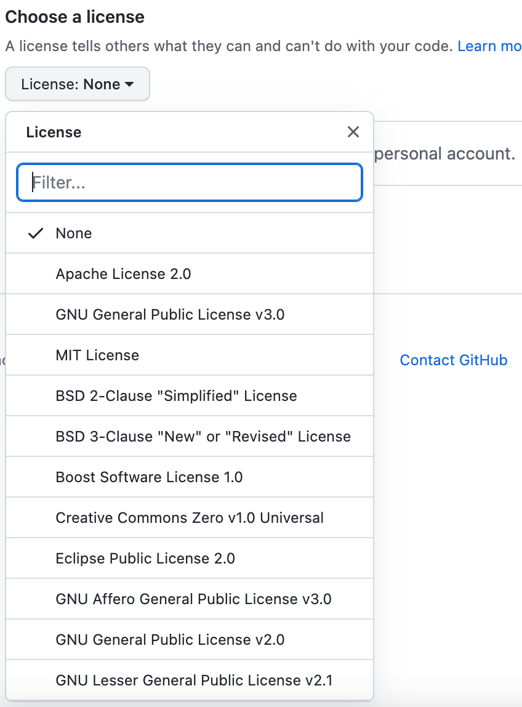

GitLab also has a license selection functionality, but the functionality is available after the repository is created (and not during creation as in Github). Therefore, you need to go to the License section to choose a related license. In addition, in GitLab, for specific licenses, the copyright is not added to the corresponding NOTICE file but the text of the license. Namely, for Apache 2.0 and GPLv3.0 licenses, it is correct to add the copyright not to the license text itself but to the NOTICE file. For Apache 2.0, the license text in the section Appendix [lines 189-190](https://github.com/oborys/Full-Guide-to-Open-Source-Licenses/blob/main/LICENSE#L189) specified what information should be entered in the NOTICE file. Same for GPLv3.0 (section END OF TERMS AND CONDITIONS) see [lines 633-635](https://github.com/oborys/Full-Guide-to-Open-Source-Licenses/blob/main/License.GNU_GPLv3.0#L635).

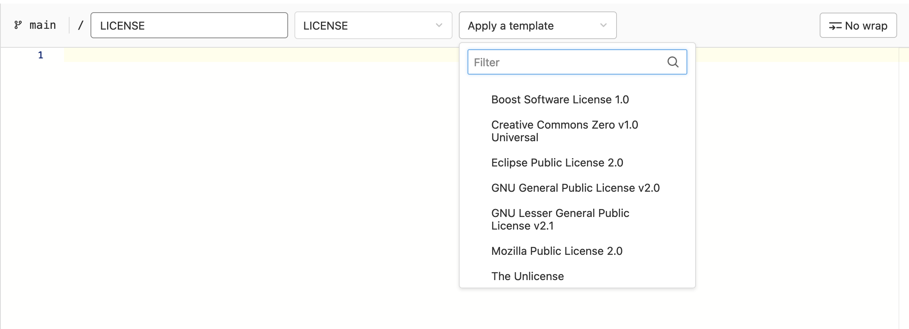

Other open source project aggregator platforms can also offer a choice of appropriate licenses or, like Google developers, limit the selection to the 6-9 most popular ones.

